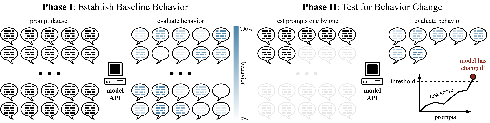

# An Auditing Test to Detect Behavioral Shift in Language Models

[](https://arxiv.org/abs/2410.19406)

This repository contains the official implementation for the ICLR 2025 paper: **[An Auditing Test to Detect Behavioral Shift in Language Models](https://arxiv.org/abs/2410.19406)**.

The project provides a framework to audit language models for behavioral shifts. The core idea is to test whether the behavior of a candidate model has changed significantly relative to a baseline model using a *testing-by-betting* framework.


A high-level overview of the auditing test.

## Core Functionality

This repository supports two main workflows:

1.  **Model Generation and Evaluation**: Generate outputs from language models for specific tasks and evaluate them using various metrics.
2.  **Behavioral Auditing**: Run the auditing test to detect statistically significant changes in behavior between two models.

### 1. Model Generation and Evaluation

You can evaluate models from the Llama-3, Gemma, and Mistral families. The chat formatting is currently optimized for these model families.

#### Supported Tasks & Datasets:

*   **Toxicity**: Using the `allenai/real-toxicity-prompts` dataset.
*   **Translation**: Using a pre-processed subset of the SuperNI dataset.

#### Configuration:

All settings for generation and evaluation can be configured in `configs/experiments/generation.yaml`. This includes selecting the model, task, dataset, and evaluation metric.

To evaluate translation performance, you first need to prepare the dataset from the [natural-instructions repository](https://github.com/allenai/natural-instructions):
```bash
git clone https://github.com/allenai/natural-instructions.git
uv run python ./src/lm_auditing/utils/preprocessing_superni.py
```

To run the evaluation, use the following command:
```bash
uv run python main.py exp=generation
```

### 2. Behavioral Auditing Test

The main contribution of this work is the auditing test, which can compare two models to identify behavioral shifts. This is particularly useful for assessing the impact of fine-tuning, detecting a model-swap or other model modifications. 

#### Supported Tasks & Metrics:

*   **Toxicity**:
    *   **Perspective API**: Measures toxicity scores using Google's Perspective API.
    *   **Toxicity Classifier**: Uses a Hugging Face-based RoBERTa model to classify toxicity.
*   **Translation**:
    *   **BLEU**: Bilingual Evaluation Understudy score.
    *   **ROUGE**: Recall-Oriented Understudy for Gisting Evaluation.

#### Configuration & Execution:

The test configurations for toxicity and translation are located in `configs/experiments/test_toxicity.yaml` and `configs/experiments/test_translation.yaml` respectively. You can specify the baseline and test models in these files.

To run a test, execute:
```bash
uv run python main.py exp=<test_config_name>
```
For example, to run the toxicity test:
```bash
uv run python main.py exp=test_toxicity
```

The core implementation of the auditing test can be found in the `src/lm_auditing/auditing/` directory.

## Quick Setup

1.  **Install uv** (if not already installed):
    ```bash
    curl -LsSf https://astral.sh/uv/install.sh | sh
    ```

2.  **Clone the repository and initialize submodules**:
    The project uses `deep-anytime-testing` as a git submodule.
    ```bash
    git clone --recursive https://github.com/richterleo/lm-auditing-test.git
    cd lm-auditing-test
    ```

3.  **Install dependencies**:
    ```bash
    uv sync
    ```

4.  **Configure API keys**:
    Create a `.env` file from the example and add your API keys.
    ```bash
    cp .env.example .env
    ```
    You will need keys for:
    - **WANDB_API_KEY**: For experiment tracking.
    - **HF_TOKEN**: For accessing gated models on Hugging Face.
    - **PERSPECTIVE_API_KEY**: For using the Perspective API toxicity metric.

## Logging and Plotting

### Logging

The framework supports multiple logging options:
*   **Console**: Default logging to the standard output.
*   **File**: Logging to a file.
*   **Weights & Biases**: Comprehensive experiment tracking, enabled by default. To disable it, add the `logging.use_wandb=false` flag to your command.

### Plotting

The provided plotting scripts are functional but may require minor adjustments to the use-case.

## Memory Optimization

If you encounter "No space left on device" errors or memory issues:

1.  **Clean HuggingFace cache**:
    ```bash
    python clear_hf_cache.py
    ```

2.  **Set custom cache directories** (in your `.env` file):
    ```bash
    TRANSFORMERS_CACHE=/path/to/larger/disk/transformers_cache
    HF_HOME=/path/to/larger/disk/hf_home
    ```

3.  **Memory optimizations** are already configured in `configs/config.yaml`:
    - 4-bit quantization with bfloat16
    - Automatic device mapping (`device_map: auto`)
    - Low CPU memory usage during loading

## Contact

For any questions or issues, please contact the authors at [leonie.richter.23@ucl.ac.uk](mailto:leonie.richter.23@ucl.ac.uk).
